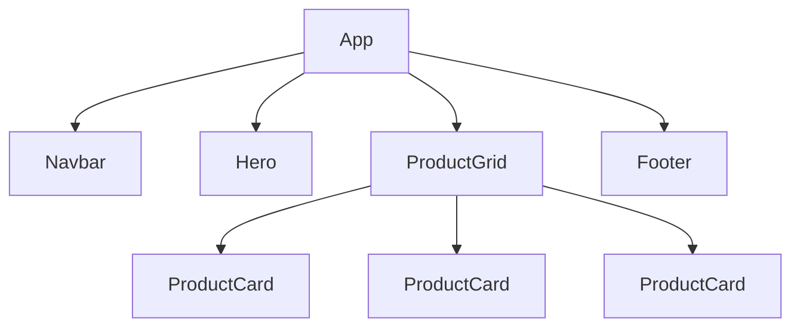

# Sơ đồ Component Tree - ShopVN

Dựa trên cấu trúc UI của một trang thương mại điện tử, chúng ta có thể tách thành sơ đồ component (cây gia phả) như sau:

## Phân tích Props Flow (Luồng dữ liệu):
- **App:** Là Component cha chứa toàn bộ State (ví dụ: mảng `products`, số lượng `cartItemCount`).
- **Navbar:** Nhận prop `cartItemCount` từ App để hiển thị số lượng giỏ hàng.
- **ProductGrid:** Nhận prop `products` (danh sách sản phẩm) từ App. Nó sẽ dùng vòng lặp `.map()` để sinh ra nhiều `ProductCard`.
- **ProductCard:** Nhận prop `product` (1 object chứa thông tin 1 sản phẩm) từ ProductGrid và nhận hàm `onAddToCart` để khi bấm nút, báo ngược lại cho App tăng giỏ hàng.
- **Hero & Footer:** Các component hiển thị tĩnh (Stateless), không cần nhận props phức tạp.
